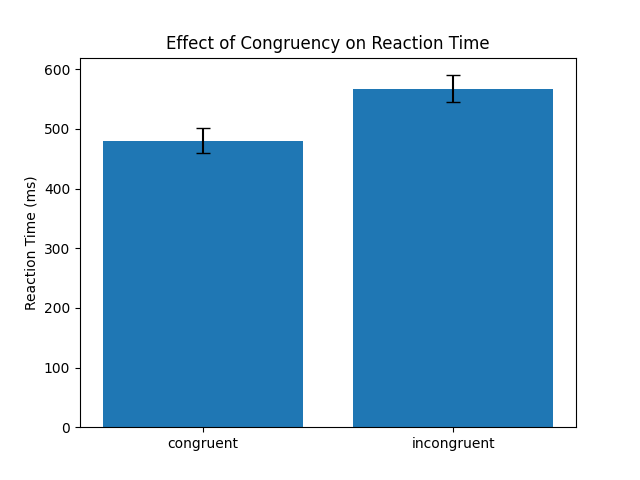

## Introduction

- First bullet point
- Second bullet point

## Methods

- First bullet point
- Second bullet point

## Results 
- For our Flanker task, we ran a repeated measures ANOVA
    - Independent variable: congruency 
    - Dependent variable: response time 
- Removed inaccurate trials
- Our ANOVA gave us F(1,15) = 56.70, p<.001

## Figure 

## Discussion
- The results show that there are differences in response time depending on the congruency of the trials 
- Incongruent trials has longer reaction times than congruent trials 
- We reject the null hypothesis 

## Conclusion
- First bullet point
- Second bullet point

